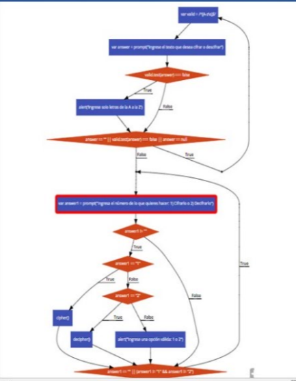
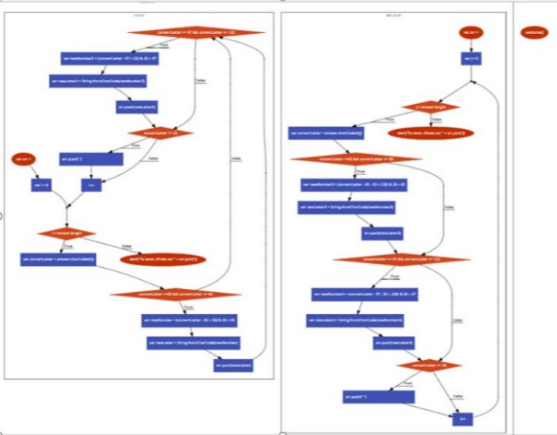

# Cifrado Cesar
## Pseudocodigo

1.-  Pedimos al usuario la accion que desea realizar usamos la funcion welcome.
      function welcome(option)
2.-  Creamos la variable valid para asegurarnos que el usuario ingrese solo letras.
            var valid = /^[A-z\s]*$/
3.-  Se crea una variable llamada answer  que mediante un prompt el usuario ingresa la accion que desea realizar.
            var answer = prompt("Ingrese el texto que desea cifrar o descifrar")

4.-  Si el cliente no usa letras solo de la A-z un alert le avisara

   if(valid.test(answer) === false){
     alert('Ingrese solo letras de la A a la Z');
    }

5.-  Si está vacío, o no es de A-z le avisa y le vuelve a preguntar.
    } while (answer == "" || valid.test(answer) === false || answer == null);

6.-  Llamamos a la funcion cifrar
    var answer1 = prompt("Ingresa el numero de lo que quieres hacer: 1) Cifrarlo o 2) Decifrarlo");
     if(answer1 != ""){
         if(answer1 == "1") {
       cipher();
7.- Llamamos a la funcion decifrar
   else if (answer1 == "2") {
   decipher();
   } else {
   alert("Ingrese una opción válida: 1 o 2");

8.- Si el usuario elige la opcion cifrar o codificar un texto.
   function cipher(){

9.- Guardamos  las letras codificadas.
   var arr = [];
10.- Obtenemos el numero equivalente en ASCII

   for(var i = 0; i < answer.length; i++){
     var convertLetter = answer.charCodeAt(i);
11.- Si es mayúsculas continuara asi:

   if(convertLetter >=65 && convertLetter <= 90){
   var newNumber = (convertLetter - 65 + 33) % 26 + 65;   Formula que transforma la mayuscula en su equivalente 33 posiciones hacia la derecha.
   var newLetter = String.fromCharCode(newNumber);        El numero equivalente lo traduce a letra.
   arr.push(newLetter);                                    Esto pushea la letra mayúscula codificada al array 'arr'
   }
12.- Si es  minuscula continuara asi
   if(convertLetter >= 97 && convertLetter <= 122){
   var newNumber2 = (convertLetter - 97 + 33) % 26 + 97;   Formula que transforma la mayúscula en su equivalente 33 posiciones hacia la derecha.
   var newLetter2 = String.fromCharCode(newNumber2);       El numero equivalente lo traduce a letra.
   arr.push(newLetter2);                                   Esto pushea la letra minuscula codificada al array 'arr'.
   }

13.- Si es un espacio devuelve un espacio. 32 en ASCII equivale a un espacio.
 if(convertLetter == 32){
       arr.push(' ')   Esto pushea el espacio codificado al array 'arr'.
     }
14.- Devuelve una alerta con la palabra cifrada.
    return alert("Tu texto cifrado es: " + arr.join(''));

15.- Si el usuario elige la opcion decifrar o decodificar un texto.
   function decipher(){
16.- Guardamos  las letras decodificadas.
   var arr = [];
17.- Obtenemos el número equivalente en ASCII

    for(var j = 0; j < answer.length; j++){
   var convertLetter = answer.charCodeAt(j);

18.- Si es mayúscula continuará asi:
    if(convertLetter >=65 && convertLetter <= 90){
       var newNumber3 = (convertLetter - 65 - 33 + 2*26) % 26 + 65;   Fórmula que transforma la mayúscula en su equivalente 33 posiciones hacia la izquierda
       var newLetter3 = String.fromCharCode(newNumber3);              El número equivalente lo traduce a letra.
       arr.push(newLetter3);                                          Esto pushea la letra mayúscula codificada al array 'arr'
     }
19.- Si es minúscula hace lo siguiente:
    if(convertLetter >= 97 && convertLetter <= 122){
       var newNumber4 = (convertLetter - 97 - 33 + 2*26) % 26 + 97;   Fórmula que transforma la mayúscula en su equivalente 33 posiciones hacia la izquierda
       var newLetter4 = String.fromCharCode(newNumber4);              el número equivalente lo traduce a letra.
       arr.push(newLetter4);                                          Esto pushea la letra minúscula codificada al array 'arr'
     }

20.- Si es un espacio devuelve un espacio. 32 en ASCII equivale a un espacio.
    if(convertLetter == 32){
       arr.push(" ")   Esto pushea el espacio codificado al array 'arr'
     }
21.-  Devuelve una alerta con  la palabra decifrada.
     return alert("Tu texto cifrado es: " + arr.join(''));

22.- Finalmente llamamos a la funcion
     welcome();

## Diagrama de flujo

